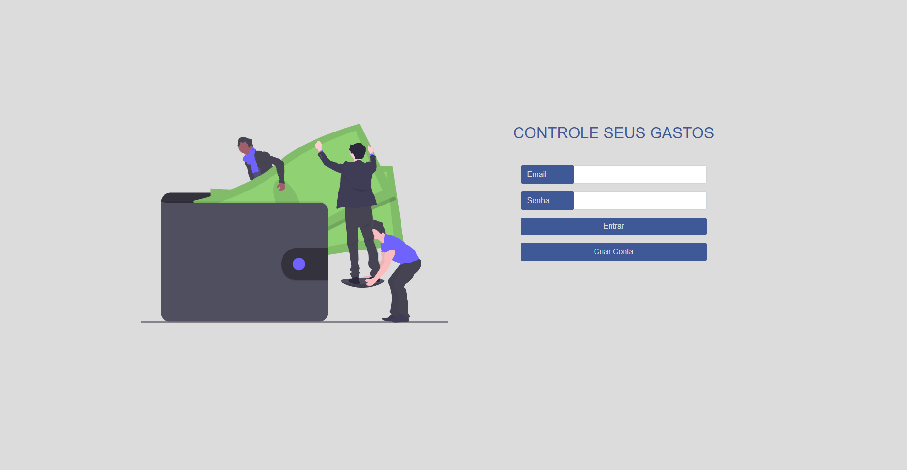
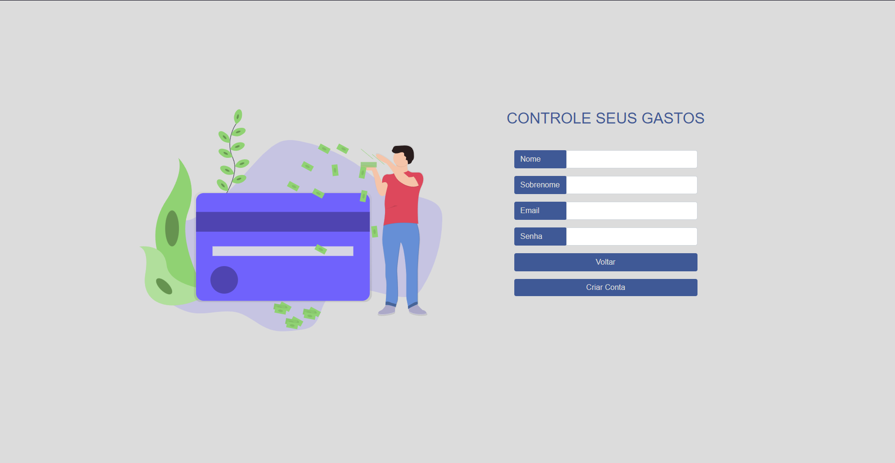
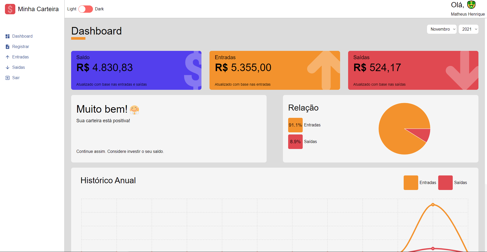
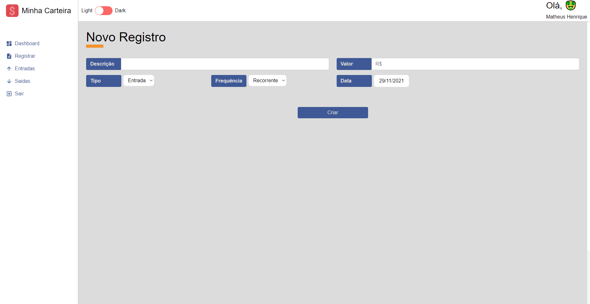
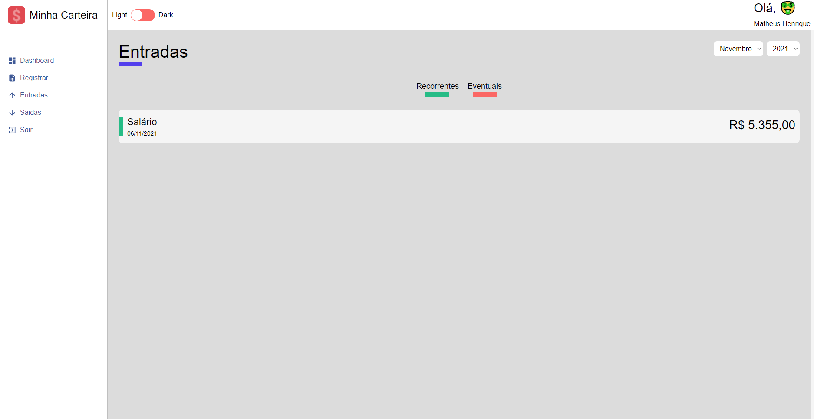
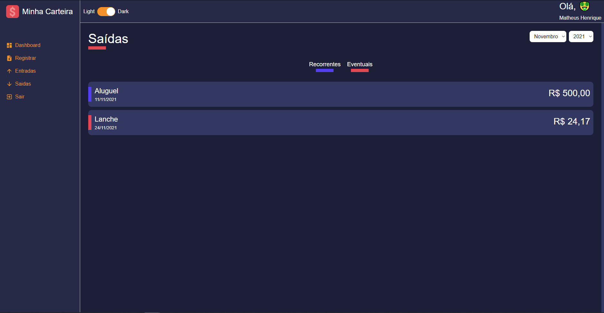

## DEMO

-   [Clique aqui para visualizar](https://expense-system-frontend.vercel.app)

## Images

-   https://undraw.co/search

## Utilizando com o ArgoCD + Kubernetes

-   `kubectl create namespace argocd`
-   `kubectl apply -n argocd -f https://raw.githubusercontent.com/argoproj/argo-cd/stable/manifests/install.yaml`
-   Argo dashboard `kubectl port-forward svc/argocd-server -n argocd 8080:443`
-   Argo password
    `kubectl -n argocd get secret argocd-initial-admin-secret -o jsonpath="{.data.password}"`,
    depois faça um decode base64
-   Crie um namespace `kubectl create namespace expense-system`
-   Crie um App no Argo
-   Sincronize o argo com o repositório git

## Utilizando com docker compose

-   `docker-compose up`

## Padrão

-   yarn start

## Emojis

-   `https://www.w3schools.com/charsets/ref_emoji_smileys.asp`

## APP

 

